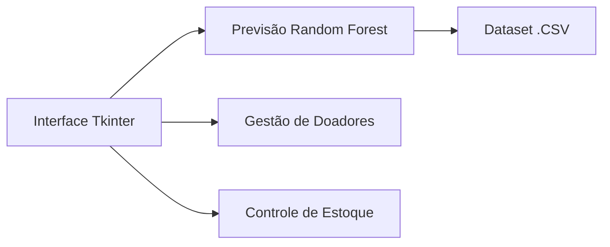

# **HemolifePro - Intelligent Blood Bank System**  
*Sistema de gestão hematológica com previsão baseada em Random Forest*  

---

## **🌡️ Funcionalidades-Chave**  
**🎯 Núcleo Inteligente**  
- **Previsão de demanda** via Random Forest (Scikit-learn)  
- **Sistema de alertas** para estoques abaixo 


**💻 Módulos Principais**  


---

## **📦 Stack Técnica**  
| Componente       | Tecnologia          | Observações                     |
|------------------|---------------------|---------------------------------|
| **Frontend**     | Tkinter             | Interface desktop               |
| **ML**           | Scikit-learn        | Modelo Random Forest            |
| **Armazenamento**| SQLite              | Dados estruturados              |
| **Processamento**| Python puro         |  |

---

## **🌲 Como o Random Forest é Aplicado**  
```python
# Exemplo simplificado do módulo de previsão
from sklearn.ensemble import RandomForestRegressor
import csv

def load_data():
    with open('data/historical_demand.csv') as f:
        reader = csv.reader(f)
        return list(reader)  # Processamento manual dos dados

def train_model():
    data = load_data()
    # Pré-processamento manual aqui
    model = RandomForestRegressor(n_estimators=100)
    model.fit(X_train, y_train)  
    return model
```

---

## **⚙️ Configuração do Ambiente**  
1. Instale as dependências mínimas:  
```bash
pip install scikit-learn numpy matplotlib
```

2. Estrutura recomendada:  
```markdown
/hemolifepro
│   /data
│   │   historical_demand.csv    # Dados para o modelo
│   │   blood_inventory.db       # SQLite
│   /modules
│   │   prediction_engine.py     # Lógica do Random Forest
│   │   inventory_manager.py     # Controle de estoque
```

---

## **📌 Melhorias Futuras**  
1. Substituir CSV por **SQLAlchemy** para queries complexas  
2. Adicionar **SHAP values** para explicar previsões  
3. Sistema de **cache** para acelerar predições  

---

